# Scrapper

Rendered version (reliable in any preview): [project-structure.svg](project-structure.svg)

Source (regenerate SVG with `npx -y @mermaid-js/mermaid-cli -i project-structure.md -o project-structure.svg`):

```mermaid
graph TD
    MW[MainWindow]

    subgraph Views
        SCV[ScrapeConfigurationView]
        SCVM[ScrapeConfigurationViewModel]
        CV[ClassificationsView]
        TV[TagsView]
        CD[ConfirmationDialog]
    end

    subgraph Workflows
        SWF[SearchWorkflowFunctional]
    end

    subgraph Pages
        SRPF[SearchResultsPageFunctional]
        IP[ImagePage]
    end

    subgraph Services
        IPS[ImagePageService]
        FCS[FileClassificationService]
        SCS[ScrapeConfigurationService]
        STS[ScrapedTagService]
        IES[ImportExportService]
        DRS[DatabaseResetService]
        PWS[PlaywrightService]
    end

    subgraph Repositories
        DRR[DatabaseResetRepository]
        FDR[FileDetailRepository]
        STR[ScrapedTagRepository]
    end

    subgraph Support
        LB[LogBroadcaster]
        IB[ImageBroadcaster]
        CS[ConfigurationSaver]
        DH[DirectoryHelper]
    end

    DB[(IDbContextFactory - AppDbContext)]
    SC[ScrapeConfiguration]

    MW -->|factory| SCV
    MW -->|factory| CV
    MW -->|factory| TV
    MW --> CD
    MW --> SWF
    MW -->|IDatabaseResetService| DRS
    LB -.->|MessageLogged event| MW
    IB -.->|ImageSaved event| MW

    SWF --> SRPF
    SWF --> SC
    SWF --> CS
    SWF --> IPS
    SWF --> DH

    SRPF -->|IPlaywrightService| PWS
    PWS --> SC

    IPS --> IP
    IPS -->|IFileDetailRepository| FDR
    IPS --> FCS
    IPS --> SC
    IPS --> DH
    IPS --> IB

    IP -->|IPlaywrightService| PWS
    IP --> SC
    IP -->|IScrapedTagRepository| STR
    IP -->|tag ignore lists| TagsFiles[TagsToIgnoreCompletely / TagsTextToIgnore]

    DRS -->|IDatabaseResetRepository| DRR
    DRS --> FS[IFileSystem]

    SCV --> SCVM
    SCV --> SCS
    SCV -->|IImportExportService| IES
    CV --> FCS
    CV -->|IImportExportService| IES
    CV --> LB
    TV -->|IScrapedTagService| STS
    TV -->|IImportExportService| IES
    TV --> LB

    STS -->|IScrapedTagRepository| STR
    IES --> FS

    CS --> SC
    CS --> DB
    SCVM --> DB
    SCS --> DB
    FCS --> DB
    DRR --> DB
    FDR --> DB
    STR --> DB
```

